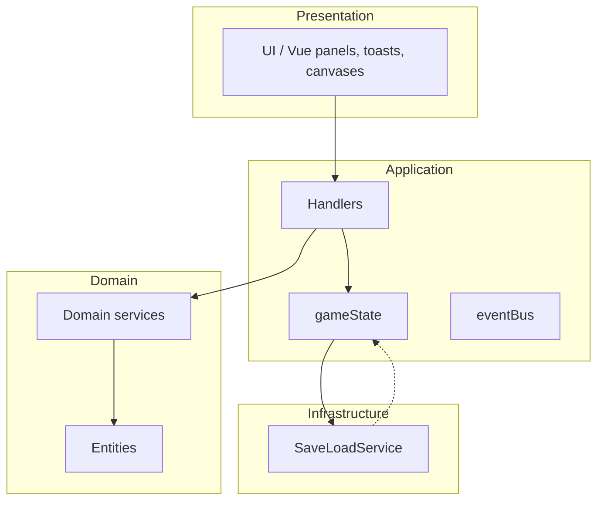
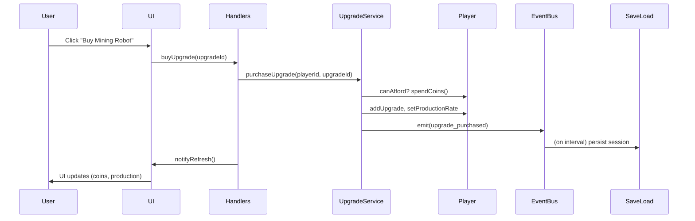
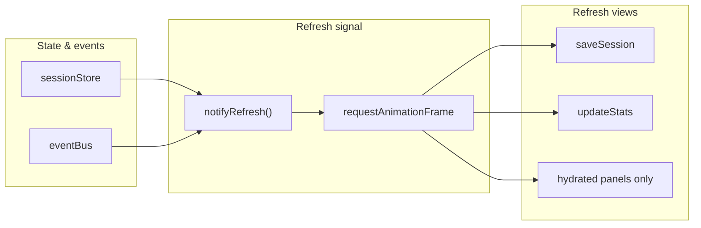

# Stellar Miner — Domain-Driven Design (DDD)

Simplified Domain-Driven Design for the idle game "Stellar Miner": domain and subdomains, entities, value objects, aggregates, domain services, and events. This model keeps the code organized and easy to extend.

---

## 1. Domains and Subdomains

**Core domain: Stellar Miner**

| Subdomain        | Role                                      |
|------------------|-------------------------------------------|
| **Mining (Core)** | Resources, upgrades, and production       |
| **Economy (Supporting)** | Transactions, costs, and revenue   |
| **Progression (Supporting)** | Save/load, prestige, quests, milestones, achievements |
| **Progression (Generic)** | Settings, stats history, offline progress |

---

## 2. Entities

Entities have identity and a lifecycle.

| Entity     | Description                                      | Main attributes (examples)        |
|------------|--------------------------------------------------|----------------------------------|
| **Player** | Player and their progression (planets, crew, coins) | id, coins, planets, prestigeLevel, totalCoinsEver, astronautCount |
| **Planet** | Mining outpost with upgrade slots and production bonus | id, name, maxUpgrades, upgrades |
| **Upgrade**| Purchasable improvement (e.g. mining robot)      | id, name, cost, effect (UpgradeEffect)   |
| **GameEvent** | Random event (e.g. meteor storm)             | id, name, effect, duration       |
| **Artifact** | Special item with permanent or temporary bonus | id, name, effect, isActive       |

---

## 3. Value Objects

Immutable, defined by their attributes.

| Value Object      | Description                              | Attributes (examples)   |
|-------------------|------------------------------------------|-------------------------|
| **Coins**         | In-game currency                         | value (number)          |
| **ProductionRate**| Coins per second production              | value (number)          |
| **UpgradeEffect** | Effect of an upgrade (e.g. +1 coin/s)    | coinsPerSecond          |
| **EventEffect**   | Effect of an event (e.g. x2 production)  | multiplier, duration    |

---

## 4. Aggregates

An aggregate is a cluster of objects treated as a single unit.

| Aggregate   | Root        | Description                                      |
|-------------|-------------|--------------------------------------------------|
| **Player**  | Player      | Holds planets (each with upgrades), artifacts, coins, crew (astronauts) |
| **GameSession** | GameSession | Holds the player, active events (with end times), and global state |

---

## 5. Domain Services

Domain logic that does not belong to a single entity or value object.

| Service           | Responsibility                                  |
|-------------------|-------------------------------------------------|
| **UpgradeService**| Purchase and apply upgrades (with astronaut requirements) |
| **PlanetService** | Buy new planets, add upgrade slots              |
| **EventService**  | Trigger and handle random events                |
| **PrestigeService** | Compute prestige bonuses and reset the run   |
| **SaveLoadService** (infra) | Save/load game state, export/import, offline progress (localStorage) |

---

## 6. Domain Events

Events that occur in the domain and can trigger side effects.

| Event               | Description                                      |
|---------------------|--------------------------------------------------|
| **CoinsMined**      | When the player clicks or gains coins passively  |
| **UpgradePurchased**| When the player buys an upgrade                  |
| **EventTriggered**  | When a random event occurs                       |
| **PrestigeActivated** | When the player triggers prestige              |

---

## 7. Layered Architecture

```
┌───────────────────────┐
│   Presentation        │  UI/UX: coins, buttons, etc.
├───────────────────────┤
│   Application         │  Orchestrates services and commands
├───────────────────────┤
│   Domain              │  Entities, value objects, domain services
├───────────────────────┤
│   Infrastructure      │  Persistence, data access, external APIs
└───────────────────────┘
```

**Mermaid (for viewers that support it):**



**Modules (src):**

- **domain/** — Entities, value objects, aggregates, events, domain services; **bigNumber** for large-number math (break_infinity).
- **application/** — gameState; **handlers** split by domain (handlers.ts re-exports from handlersSave, handlersMine, handlersUpgrade, handlersPlanet, handlersQuest, handlersPrestige, handlersResearch, handlersSettings, handlersDebug); catalogs, quests, progression, stats, format, eventBus, strings, research, achievements, milestones, questState, playTimeStats, productionHelpers, crewHelpers, planetAffinity, **solarSystems**; i18nCatalogs; **version**, **changelog**. **uiBridge** (presentation port: handlers and app code call `getPresentationPort()` for toasts, overlay, flash; no application → presentation imports). **panelConfig** (PANEL_IDS, getPanelElementId). **sessionSerialization** (deserializeSession for save payload → GameSession). **canvasApis** (StarfieldApi, MineZoneCanvasApi interfaces; implementations injected from game.ts).
- **presentation/** — Vue 3 root (`presentation/vue/`): **App.vue** (header, StatsBlock, tabs, PanelsShell, modals, ToastContainer). All tab panels (Mine, Dashboard, Empire, Research, Upgrades, Stats) are Vue; **PanelsShell** renders the panel structure; Vue panels (EmpirePanel, ResearchPanel, etc.) mount into their containers on first tab switch. Modals (settings, info, achievements, reset/prestige, events hint, chart help, section rules, upgrade choose planet, planet detail, expedition, intro) are Vue components. initPresentation() (presentation/initPresentation.ts) requires Vue shell (#main-content, #panels); it wires theme, translations, settings subscribers, intro, tabs init, and tooltips. All event bindings (keyboard, overlay click, mine zone, debug) are in Vue. Views (statsView, questView, comboView, progressionView, etc.) still update DOM by ID for mine/quest; Vue provides the nodes. Toasts via **toastStore** and **ToastContainer**. **presentationPortImpl**, StarfieldCanvas, MineZoneCanvas. Reusable UI in **presentation/components/**.
- **infrastructure/** — SaveLoadService (save/load/export/import, version, validation; **deserializer and getResearchProductionMultiplier/getUnlockedResearch injected from application**)
- **data/** — JSON config: upgrades, events, research, achievements, progression, planetAffinity, balance, gameConfig, changelog
- **e2e/** — Playwright E2E tests

---

## 8. Example Flow: Purchasing an Upgrade

1. User clicks "Buy Mining Robot".
2. **Application** calls `UpgradeService.purchaseUpgrade(playerId, upgradeId)`.
3. **Domain**:
   - Check player has enough Coins.
   - Emit **UpgradePurchased**.
   - Update player **ProductionRate**.
4. **Infrastructure** (optional): persist player state.

**User journey (Mermaid):**



---

## 9. Reactive UI Flow

State changes trigger UI refresh through a batched pipeline:

1. **Observables** (`gameState.ts`) — `sessionStore`, `settingsStore`, `activeEventsStore`, `questStateStore` hold reactive state.
2. **Refresh signal** (`refreshSignal.ts`) — `notifyRefresh()` schedules listeners for the next `requestAnimationFrame`; multiple rapid calls coalesce into one.
3. **Subscribers** (`refreshSubscribers.ts`) — `sessionStore` and domain events (upgrade_purchased, prestige, quest_claimed, planet_bought, astronaut_hired) call `notifyRefresh()`; `subscribeRefresh(refreshViews)` runs the full refresh.
4. **Refresh views** (`game.ts`) — `createRefreshViews()` runs `saveSession`, `updateStats`, and renders only **hydrated** panels (see below).

**Reactive UI flow (Mermaid):**



**Lazy loading** — Tab panels (upgrades, empire, research, dashboard, stats) render only when the user first switches to that tab. `lazyPanels.ts` tracks `hydratedPanels`; `switchTab` calls `markPanelHydrated(id)` and renders the panel; `createRefreshViews` skips non-hydrated panels to avoid unnecessary DOM work.

---

## 10. Code References (TypeScript)

- **Player**: `src/domain/entities/Player.ts` — `Player.create(id)`, `addCoins`, `spendCoins`, `setProductionRate`, `planets`, `effectiveProductionRate`, `hireAstronaut`, `spendAstronauts`, `Player.createAfterPrestige`.
- **Planet**: `src/domain/entities/Planet.ts` — `Planet.create`, `addUpgrade`, `hasFreeSlot`, `usedSlots`, `maxUpgrades`.
- **UpgradeService**: `src/domain/services/UpgradeService.ts` — `purchaseUpgrade`, `canAfford`, `getRequiredAstronauts`.
- **PlanetService**: `src/domain/services/PlanetService.ts` — `buyNewPlanet`, `addSlot`.
- **GameSession**: `src/domain/aggregates/GameSession.ts` — aggregate root; holds `player`, `activeEvents`.
- **Value objects**: `src/domain/value-objects/` — Coins, ProductionRate, UpgradeEffect, EventEffect.
- **Application state**: `src/application/gameState.ts` — session, active event instances, next event time, settings, quest state; `getOrCreateSession`, `saveLoad`, `getEventMultiplier`.
- **Catalogs & config**: `src/application/catalogs.ts` — UPGRADE_CATALOG, EVENT_CATALOG, combo/lucky/quest constants, storage keys.
- **Handlers**: `src/application/handlers.ts` re-exports; domain-specific modules: handlersSave, handlersMine, handlersUpgrade, handlersPlanet, handlersQuest, handlersPrestige, handlersResearch, handlersSettings, handlersDebug — mine click, buy upgrade/planet/slot/housing, hire astronaut, prestige, quest claim, export/import save, settings, debug.
- **Presentation**: `src/presentation/` — mount; tabs Mine, Empire, Research, Upgrades, Stats; statsView (Empire panel), upgradeListView, planetListView (housing on each planet card), questView, comboView, progressionView, prestigeView, crewView, statisticsView, researchView, housingView (build housing), toasts, tooltip, StarfieldCanvas, MineZoneCanvas.
- **Research**: `src/application/research.ts` — tech tree / research unlocks; `researchView` for UI.
- **Planet affinity**: `src/application/planetAffinity.ts` — planet type (rocky/desert/ice/volcanic/gas) and affinity stats derived from planet name; data in `src/data/planetAffinity.json`.
- **Achievements & milestones**: `src/application/achievements.ts`, `src/application/milestones.ts` — progression unlocks and one-off rewards.
- **Version & changelog**: `src/application/version.ts`, `src/application/changelog.ts` — app version (from package.json at build), "What's new" modal; `src/data/changelog.json` (newest first).
- **Persistence**: `src/infrastructure/SaveLoadService.ts` — save/load/export/import, offline progress (capped), `SAVE_VERSION`, `isSavedSession()`, `validateSavePayload()`; `src/settings.ts` — user settings (starfield, layout, pause when background, theme, soundEnabled, reducedMotion).
- **Event bus**: `src/application/eventBus.ts` — `subscribe(kind, fn)`, `emit(kind, payload)` for upgrade_purchased, prestige, quest_claimed, planet_bought, astronaut_hired, session_loaded, save_success, save_failed.
- **Refresh signal**: `src/application/refreshSignal.ts` — `notifyRefresh()`, `subscribeRefresh(fn)`; batches calls into one rAF.
- **Refresh subscribers**: `src/application/refreshSubscribers.ts` — `wireRefreshSubscribers`, `wireEventBusToRefresh`, `wireSettingsSubscribers`; wires observables and events to UI refresh.
- **Lazy panels**: `src/application/lazyPanels.ts` — `markPanelHydrated`, `isPanelHydrated`, `resetPanelHydration`; tracks which tab panels have been rendered.
- **Strings**: `src/application/strings.ts` — `strings` map and `t(key)` for UI copy (invalid save, offline banner, etc.); language modules in `strings/en.ts`, `strings/fr.ts`.

---

## 11. Current Flows (Summary)

- **Mine click**: Handlers → mine click (lucky/critical), combo tracking, coins, toasts; game loop applies passive production and event multiplier.
- **Buy upgrade**: Handlers → PlanetService/UpgradeService (planet choice if multiple slots); persistence on interval.
- **Planets & crew**: Buy new planet (PlanetService), add slot (cost scaling), **build housing** on each planet (planet card); hire astronauts (Player); production = upgrades × planet bonus × prestige × crew bonus. **Empire** tab shows production breakdown, crew, planets (with housing), quests, prestige.
- **Quests**: Quest state in gameState; generate/claim in handlers; streak bonus; render in questView.
- **Prestige**: PrestigeService + handlers; reset to one planet, prestige level +1, bonus to production.
- **Events**: Game loop checks `nextEventAt`; handlers trigger random event from catalog; active events multiply production until they expire.
- **Save/load**: SaveLoadService every 3s; payload has `version: 1`; load/import validate with `isSavedSession()`; on load, offline progress applied (capped 12h); export/import in settings UI; retry once on save failure.
- **Settings**: Persisted in localStorage (starfield speed, orbit lines, click particles, compact numbers, space repeat, layout, pause when background, **theme**, **sound**, **reduce motion**); theme and reduced motion applied via `data-theme` / `data-reduced-motion` on `<html>`.
- **Offline**: Banner shown when `navigator.onLine` is false; copy from `strings.offlineIndicator`.

---

## 12. Implemented Improvements

1. **Accessibility** — ARIA on tablist/tabs/panels and modals; keyboard: 1–4 switch tabs, Tab trapped in open modal, Escape closes modal; focus moved to first focusable when opening settings/reset/prestige; **Reduce motion** setting with `data-reduced-motion` and matching CSS.
2. **Error handling** — Save retries once on failure; **`isSavedSession()`** type guard before deserialize; **offline banner** when `navigator.onLine` is false (see `strings.offlineIndicator`).
3. **Performance** — Stats history **only writes to storage when a new point is recorded**; **requestIdleCallback** for statistics section updates in the game loop.
4. **Testing** — **Playwright** E2E in `e2e/` (smoke, mine zone, tabs); unit tests for **eventBus** and **gameState**.
5. **i18n** — **`src/application/strings.ts`** with `t(key)`; used for invalid save and offline banner; catalog data remains in catalogs.
6. **Settings** — **Theme** (light/dark), **Sound effects**, **Reduce motion** in `settings.ts` and settings UI; all persisted.
7. **Save format** — **`version: 1`** in serialized payload; **`isSavedSession()`** validation; legacy (no version) still loads; **`SAVE_VERSION`** and **`validateSavePayload()`** in SaveLoadService.
8. **DevEx** — **ESLint** (`.eslintrc.cjs`) and **Prettier** (`.prettierrc`) at repo root; **Playwright** (`playwright.config.ts`, `e2e/`); scripts **`npm run lint`**, **`npm run format`**, **`npm run test:e2e`**.
9. **Documentation** — This file and README kept in sync. See **docs/README.md** for the full index. **docs/reference/progression-curve.md** (economy, upgrades, install duration, unlocks, milestones); **docs/reference/research-formulas.md** (research formulas, success chance, full node catalog); **docs/reference/planets-formulas.md** (planet cost, expedition, slots, housing); **docs/features/** (exhaustive feature list); **docs/data/** (schemas). Backlog and tasks: project kanban (**project/tasks/**).
10. **Observability** — **`src/application/eventBus.ts`**: subscribe/emit for upgrade_purchased, prestige, quest_claimed, planet_bought, astronaut_hired, session_loaded, save_success, save_failed; **performance.mark** in game loop and in SaveLoadService save.
11. **Handlers** — Split by domain into **handlersSave**, **handlersMine**, **handlersUpgrade**, **handlersPlanet**, **handlersQuest**, **handlersPrestige**, **handlersResearch**, **handlersSettings**, **handlersDebug**; **handlers.ts** re-exports for a single entry point.
12. **Planet affinity** — Planet type (rocky/desert/ice/volcanic/gas), visuals (colors, texture, rings/belt, size) and affinity stats derived deterministically from planet name; **planetAffinity.ts** + **data/planetAffinity.json**.
13. **Layer separation** — Application does not import presentation. **uiBridge** (presentation port): handlers and achievements/milestones call `getPresentationPort()` for toasts, overlay, flash, combo; port is set at bootstrap in game.ts from **presentationPortImpl**. **gameState** uses **canvasApis** interfaces (StarfieldApi, MineZoneCanvasApi); implementations injected from game/mount. **SaveLoadService** receives deserializer and getResearchProductionMultiplier/getUnlockedResearch from application; **sessionSerialization.ts** owns deserialize logic. **panelConfig** centralizes panel IDs and refresh; **PANEL_REFRESH_ACTIONS** in game.ts drives which views refresh per hydrated panel.

---

## 13. Game rules (how to play)

Summary of the game's rules and numbers. Exact values come from **balance.json**, **gameConfig.json**, **progression.json**, and the data catalogs. For the full feature list and formulas, see **docs/features/** and **docs/reference/**.

### Goal

Mine coins (click or idle), buy upgrades and hire crew, expand to new planets, complete quests, and Prestige to gain permanent bonuses so each run goes further.

### Mine click

- **Base**: 1 coin per click before Prestige 1. After Prestige 1, click bonuses apply (Lucky, Super Lucky, Critical, Combo, Research +% click).
- **Lucky / Super Lucky / Critical**: Random multipliers on click (chances and ranges in **gameConfig.lucky**). Unlocked after first Prestige.
- **Combo**: Click within **2.4 s** of the previous click to build a combo. Minimum **6 clicks** to get a multiplier; each extra level adds **+9%** up to **×1.55** (names: Hot, On fire, Unstoppable, Legendary, Mega). Combo applies to click reward.

### Upgrades

- **Catalog**: **data/modules.json** (tiers 1–10, multiple modules per tier). Each module has cost, coins/s, and required astronauts. Many have planet-type affinity (bonus on Rocky, Desert, Ice, Volcanic, Gas). Cost for the next copy: **baseCost × 1.19^ownedCount**.
- **Slots**: Each planet has a limited number of slots (default **6**). Most upgrades and each housing module use one slot. Add slots per planet at scaling cost (**25,000 × slots^1.38**, first expansion **×0.82**).

### Crew (astronauts)

- **Hire cost**: **2,500 × 1.2^count** (next astronaut costs more). **+1.5%** production per astronaut (stacking).
- **Capacity**: Base **2** per planet; each **housing** on any planet adds **+2** capacity. Overcrowding applies a morale malus.
- **Professions**: Miners, scientists, pilots (and veterans from expeditions). Bonuses from **balance.json** (miner, scientist, pilot, veteran, morale).

### Planets and expeditions

- **New planet cost**: **120,000 × (planetCount + 1) × 1.28^planetCount**.
- **Expedition**: Requires **2–6** astronauts (scales with planet count). **Duration** increases with planet count (base + per-planet ms). Each astronaut has a **death chance**; if all die, the planet is not discovered.
- **Planet bonus**: **+4%** production per extra planet (first planet is base).

### Housing

- **Cost per planet**: **12,000 × 1.26^count** (count = housing already on that planet). **+2** crew capacity per housing. Uses one upgrade slot on that planet.

### Research

- **Skill tree**: **data/research.json**. Unlock nodes by spending coins; each attempt has a success chance (can fail, coins lost). Scientists in crew increase success chance (capped). Grants **+% production** and **+% click**. **Resets on Prestige.**

### Events

- **Trigger**: Random event every **~2 min** (interval and min delay in **gameConfig.timing**). First event after unlock is sooner (**firstEventDelayMs**).
- **Pool**: Only **positive** events until **4** events have been triggered in the run; then **negative** events can appear (**events.negativeUnlockAfterTriggers**). Each event has a **multiplier** and **duration**; active events multiply production until they expire.

### Quests

- **Unlock**: **250,000** coins (progression).
- **Types**: Random (coins, production, upgrade, astronauts, prestige_today, combo_tier, events_triggered, tier1_set). Reach the target, then **Claim**.
- **Streak**: Claim within **5 minutes** of completing a quest to build a streak. **+12%** reward per streak level (max streak **3**). If you don't claim in time, streak resets.

### Prestige

- **Threshold**: **5,000,000** coins (current wallet).
- **Effect**: Reset run (coins, planets, upgrades, crew, research). Keep **Prestige level** and **total coins ever**. **Production**: +7% per level (base) + banked +1% per planet discovered at prestige + banked +0.5% per research node at prestige (permanent). From **Prestige 2** onward, **+4%** click per level (stacking).

### Offline progress

- **Minimum absence**: **1 minute** before offline coins apply.
- **Cap**: Full production rate for up to **12 hours**. After 12 h: **80%** rate for 12–14 h, then linear decay to **50%** at 24 h; beyond 24 h, **50%** rate.

### Milestones and achievements

- **Milestones**: Toasts when **total coins ever** crosses thresholds (from **gameConfig.milestones**).
- **Achievements**: Unlock by prestige level, quest streak, combo master, etc. (**data/achievements.json**). Shown in Stats.

### Daily bonus

- **800** coins once per calendar day (**gameConfig.dailyBonusCoins**).

### Progression unlocks (coin thresholds)

Features unlock when **current coins** (wallet) reach a threshold (**progression.json**): Welcome 0, Upgrades 30, Crew 1,500, Research 12,000, Planets & Events 120,000, Quests 250,000, Prestige 5,000,000.
